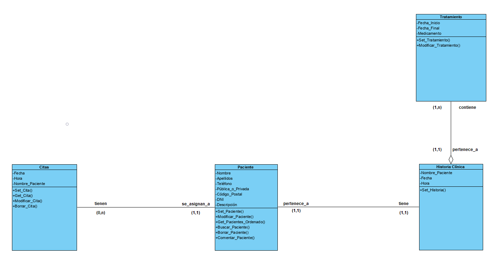

## Clase Citas
#### Descripcion:
Esta clase almacena los datos de la citas, asi como los datos de los pacientes asociados a ellas.También posee las funciones necesarias para gestionar las citas.

#### Atributos:
* Fecha :
  * Tipo: String
  * Descripción: Día en el que se almacena la cita
 * Hora:
   * Tipo: String
   * Descripción: Hora a la que se almacena la cita
 * Nombre_Paciente:
   * Tipo: String
   * Descripción: Nombre al que esta asociado la cita

#### Operaciones:
* Cita:
  * Descripción: Constructor de la clase. Permite inicializar todos los parámetros imprescindibles para el uso de la clase.
* Set_Cita :
  * Descripción: Funcion que resgistra una cita de un paciente en la base de datos a una hora y fecha en concreto.
* Get_Cita:
  * Descripción: Funcion que imprime por pantallas las citas programadas para el dia actual.
* Modificar_Cita:
  * Descripción: Funcion que permite reemplazar los datos de una cita previamente programada.
* Borrar_Cita:
  * Descripción: Función que permite eliminar de la base de datos una cita previamente programada.
  
  ----
  
## Clase Historia Clínica
#### Descripción:
Esta clase almacena los datos clinicos de cada paciente asi como los incluidos en la clase tratamiento.

#### Atributos:
* Fecha:
  * Tipo: String
  * Descripción: Día en el que se almacena la cita
 * Hora:
   * Tipo: String
   * Descripción: Hora a la que se almacena la cita
 * Nombre_Paciente:
   * Tipo: String
   * Descripción: Nombre al que esta asociado la cita

#### Operaciones:
* HistoriaClinica:
  * Descripción: Constructor de la clase. Permite inicializar todos los parámetros imprescindibles para el uso de la clase.
* Set_Historia:
  * Descripcion: Esta función recoge los datos necesarios tanto clinicos como del paciente, para añadir una historia clínica a la base de datos.
  
  ----
  
## Clase Paciente
#### Descripción:
Esta clase contiene los atributos y las funciones de los pacientes. Entre las funciones se puede encontrar añadir un paciente nuevo, modificar datos de un paciente y mostrar una lista de los pacientes ordenada alfabéticamente.

#### Atributos:
* Nombre:
    * Tipo string
    * Descipción : Nombre del paciente
* Apellidos:
    * Tipo string
    * Descripción: Apellidos del paciente
* Teléfono:
    * Tipo long
    * Descripción: Teléfono de contacto del paciente
* Pública_o_Privada:
    * Tipo string
    * Descripción: Tipo de sanidad de la que proviene el paciente
* Código_Postal:
    * Tipo integer
    * Descripción: número identificador de dirección del paciente
* DNI:
    * Tipo string
    * Descripción: identificador del paciente
* Descripción:
    * Tipo string
    * Descripción: breves apuntes sobre el paciente

#### Operaciones:
* Paciente:
    * Descripción: Constructor de la clase. Inicializa los parámetros obligatorios(DNI,nombre,apellidos) para el uso de la clase.
* Set_Paciente:
    * Descripción: Función que añade un nuevo paciente a la base de datos.
* Modificar_Paciente:
    * Descripción: Función que permite modificar los datos de un paciente.
* Get_Pacientes_Ordenado:
    * Descripción: Función que muestra la lista de pacientes ordenados alfabéticamente.
* Buscar_Paciente:
    * Descripción: Función que busca un paciente tras introducir sus apellidos.
* Borrar_Paciente:
    * Descripción: Función que permite borrar un paciente de la base de datos.
* Comentar_Paciente:
    * Descripción: Función que permite hacer apuntes sobre un paciente.
    
    ----
    
## Clase Tratamiento
#### Descripción:
Esta clase contiene los atributos y las funciones de los tratamientos. Contiene dos funciones, añadir tratamiento y modificar tratamiento.

#### Atributos:
* Fecha_Inicio:
    * Tipo string
    * Descipción: fecha en la que comienza el tratamiento
* Fecha_Final:
    * Tipo string
    * Descripción: fecha en la que finaliza el tratamiento
* Medicamento:
    * Tipo string
    * Descripción: medicación que toma el paciente durante el tratamiento

#### Operaciones:
* Tratamiento:
    * Descripción: Constructor de la clase. Permite inicializar todos los parámetros de la clase.
* Set_Tratamiento:
    * Descripción: Función que permite introducir un nuevo tratamiento en la historia clínica de un paciente.
* Modificar_Tratamiento:
    * Descripción: Función que permite modificar el tratamiento en curso de un paciente.

----
